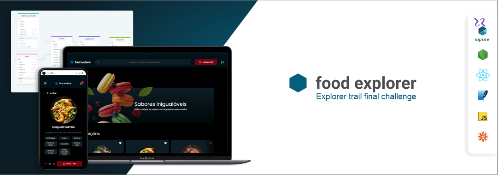
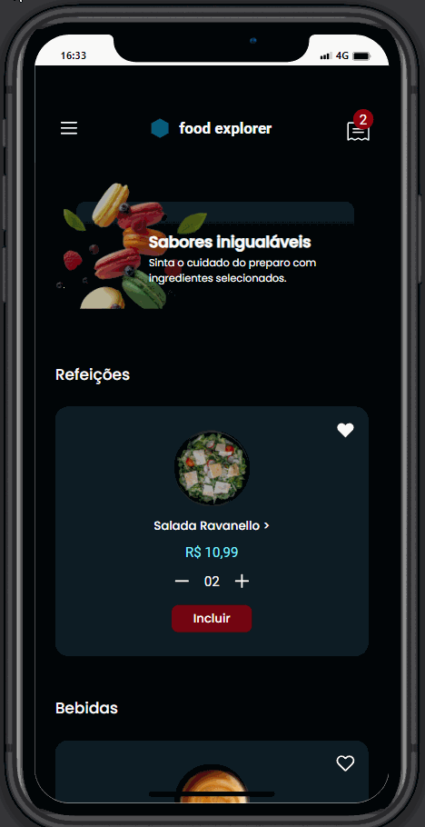
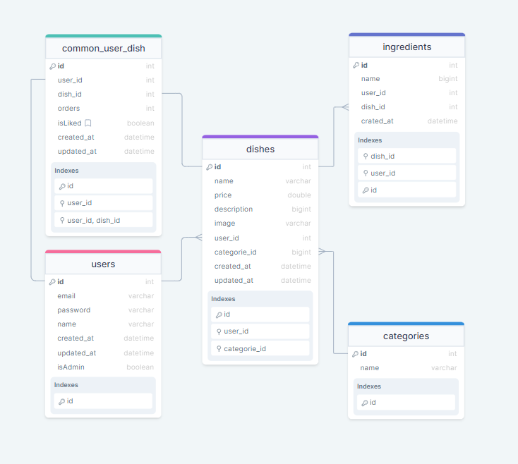

<p align="left">
    <a href="https://food-explorer-web-app.netlify.app/">
        
    </a>
</p>


<br> 
<br>


<div style="display: inline_block" align=center >

</div>

# 🎯 Food Explorer - Challenge
### Develop a food menu web application with routes for administrators and common users

<br>

# ▶️ Run
```
    npm install
    npm run dev
```

## 🌐 Backend repository [Click here!](https://github.com/jacksonMarcelinoFreitas/Front_End_Food_Explorer)


## 💫 Figma Prototype [Click here!](https://www.figma.com/file/ElOPzLcIZWRWNrZomTe90y/food-explorer-v2-(Community)?type=design&node-id=5%3A980&mode=design&t=axsUrYgtCSot71j1-1)


<br> 


# 💻Desktop screen
<div style="display: block" align=left >
  
  
  
</div>


<br> 


# 📱 Mobile screen
<div style="display: inline_block" align=left >
  
  
</div>


<br>


# 📃 Database diagram
  <div style="display: inline_block" align=left >
  
</div>


<br> 
<br>


# ⚙️ Tecnologies
<div style="display: inline_block" align=left >
    
    
    
    
    
    
    
</div>

<br>

<p align="center">
  
  <p align="center" style="font-size: 12px">Jackson Freitas<p>
</p>

